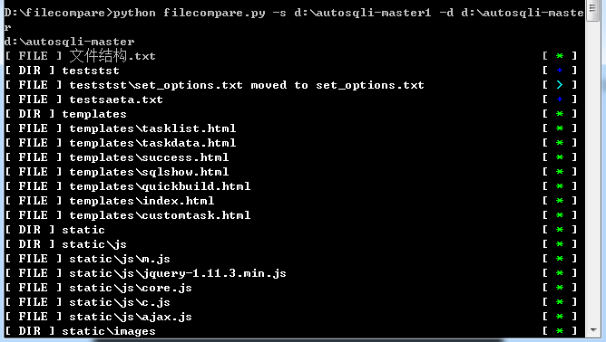
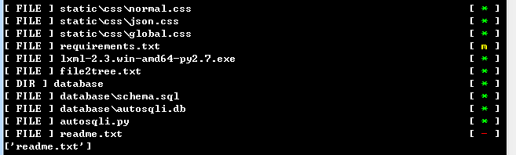

# File Compare tool

## 功能
比较两个不同文件夹下所有文件夹和文件的不同
## 示例

## 用法
`python filecompare.py -s [source folder] -d [destination folder]`
以-d后面的文件夹作为基准，检测-s后面的文件夹中的不同
主要检测**新增**、**删除**、**修改**、**一致**、**移动**五种。
## 符号
| 符号| 含义 |
| :-----: | :----:  |
| + | 新增 |
| - | 删除 |
| m | 修改 |
| * | 一致 |
| > | 移动 |
